# LimHyeongGyun.github.io

# NineTailFox Adventure(임형균, 이승현)

# [ 목차 ]

### 1. [컨셉](#1)

### 2. [관련 이미지 & 동영상](#2)

### 3. [컨셉 & 대표이미지 기반 작품묘사](#3)

### 4. [NineTailFoxAdventure구성 요소](#4)

### 5. [게임 시스템 디자인](#5)

### 6. [개발 요구사항 & 흐름도](#6)

#### 6-1. [개발 요구사항 & 흐름도(1년차)](#61)

#### 6-2. [개발 요구사항 & 흐름도(6주차)](#62)

### 7. [시간별 흐름도 flowchart](#7)

### 8. [키보드 이벤트에 대한 흐름도](#8)

### 9. [용어정리](#9)

### 10. [스토리보드](#10)

### 11. [깃허브블로그](#11)

### 12. [6주차 요구사항 작업결과](#12)

# 1.컨셉<a name ='1'><a/>

## 메인컨셉:

-상호작용/인터렉티브한 게임을 만들게되면 플레이어가 더 다양하고 많은 플레이 경험을 쌓으며 재밌게 플레이할 수 있게하기 위함

### 서브컨셉1:

-탈출/함정을 피하고 가로막는 것들을 피하여 탈출하는 것에 재미를 주기위해 특정 환경과 특정 동물과의 상호작용으로만 탈출 할 수 있게 함

### 서브컨셉2:

-구출/플레이어 캐릭터의 다양성과 시각적 재미를 위해 구출시킴으로서 다양한 동물캐릭터를 조작하게 함

### 서브컨셉3:

-변신/변신키를 눌러 구출한 동물들로 변신을 하여 동물에 따른 특성으 적재적소에 활용해 탈출함

### 서브컨셉4:

-퍼즐/알맞은 환경과 동물캐릭터를 맞추어 상호작용으로 탈출하는 것을 구현하고 탈출요소에 퍼즐요소를 추가하여 진행시킬 예정이다.

### 서브컨셉5:

-타이밍/타이밍 노트 시스템을 추가하여 타이밍을 잡기위해 집중해야 하도록 만들 예정이다.

[목차](#목차)

# 2.관련 이미지 & 동영상 <a name ='2'><a/>

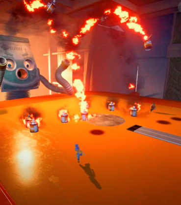
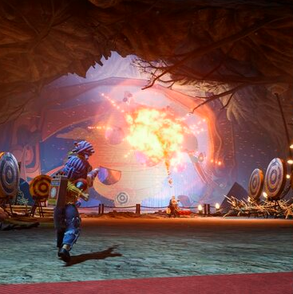

[목차](#목차)

# 3.대표 이미지

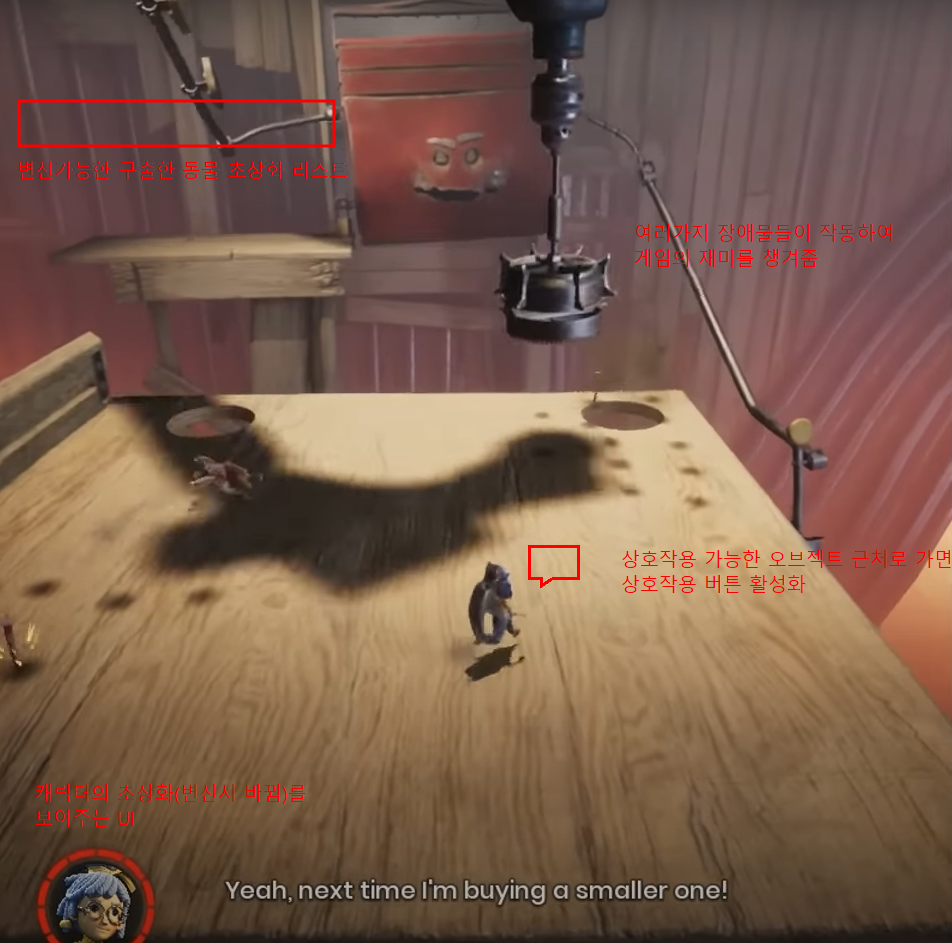

# 컨셉 & 대표이미지 기반 작품묘사 <a name ='3'><a/>

대표 이미지 기반:

컨셉 기반:

[목차](#목차)

# [NineTailFoxAdventure 구성 요소] <a name ='4'><a/>

제목:NineTailFox Adventure

## 1.매커니즘

도전과제: 주인공인 구미호 캐릭터가 정신을 차려보니 영문도 모르는 곳에 있었다. 그곳에서 여러 장애물들을 헤쳐나가고, 갇혀있는 동물들을 구조하여 동료가돼 함께 탈출을 하려고 시도한다.

재미요소: 구미호가 다른 동물로 변신하여 그 동물의 특징을 이용해야만하는 장애물들을 전략적으로 클리어하면서 여러 상호작용을 통해 재미와 성취감을 느낄 수 있다.

## 2.이야기

만들게 된 배경: 처음에는 스테이지식의 탈출게임이 될 듯 하였다. 하지만 기획을 짜며 이야기하고 고민하다보니 스테이지 형식보다는 중간중간 세이브하며 한번에 플레이하는 방식이 더 좋을 듯 하다고 생각했다.
그러면서 어떤 캐릭터로 탈출을 시키면 좋을까 생각을 하다가 연구실 컨셉을 생각하며 전설의 동물인 구미호를 컨셉으로 잡는게 좋겠다는 생각이 들었다.

참신함: 보통 탈출 게임은 캐릭터는 이동만 하며 맵에 신경을 많이 쓰는데, 우리 게임은 나오는 맵 디자인에 따라 알맞게 캐릭터를 변경시켜야 한다는 점이 참신하다고 생각했다.

카메라 관점: 캐릭터를 기준으로 기본적으로는 백 쿼터뷰로 진행하며 상황에 따라 사이드뷰도 고민해보고있다.

## 3.미적요소

디자인: low poly의 동물 디자인을 활용할 것이며, 에셋과 유니티프로빌더를 활용하여 레벨디자인을 구상할 것이다.

컬러: 전체적인 맵 색상은 어두운 느낌의 연구실 분위기를 띄도록 할 것 이다. 그에 비해 캐릭터들은 밝은 색상을 활용하여 캐릭터에 좀 더 집중되도록 할 것이다.

음향: 각 동물들의 기본적인 발소리와 게임 전체적으로 잔잔한 BGM, 그리고 각 장애물이나 오브젝트 상호작용에 따른 사운드가 들어갈 것이다.

## 4.기술

unity를 활용하여 C#을 통해 PC기반의 게임을 만들 계획이다. 키보드를 통해 조작이 가능하다.

# 게임 시스템 디자인<a name ='5'><a/>

## 1.게임 오브젝트 분해(구성 요소 분석)

|연번|종류|OBJ한글이름|OBJ영어이름|사용처|이미지|
|------|---|---|---|---|---|
|1|플레이어|플레이어|Player|공통|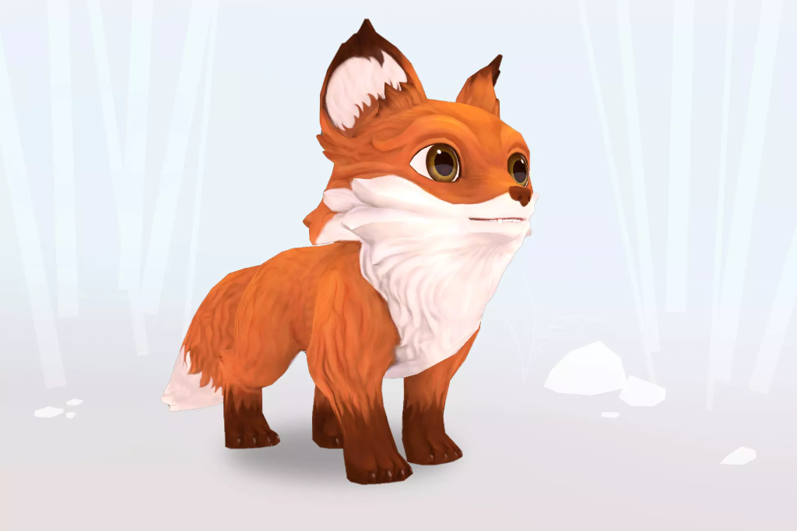|
|2|세이브포인트|세이브포인트|Save|게임 진행 중간중간|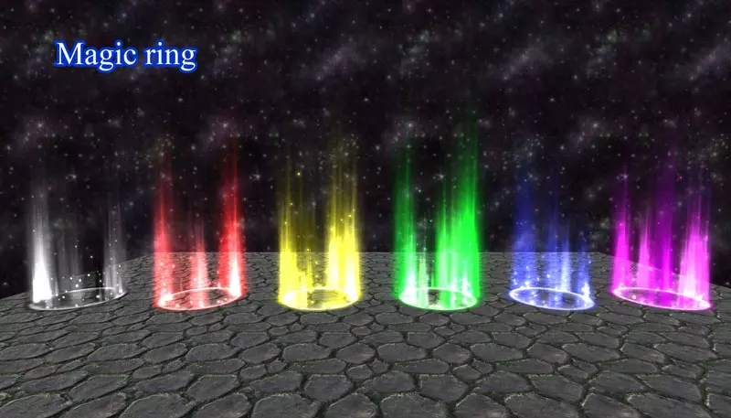|
|3|레벨|맵|Map|공통|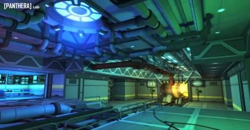|
|4|퍼즐|퍼즐|Puzzle|게임 중,후반부|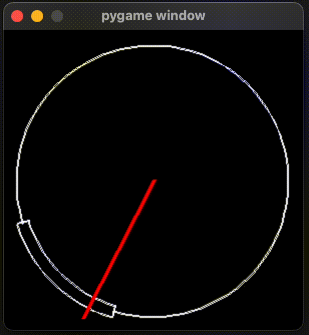|
|5|동물|참새|Bird|첫 세이브포인트 전까지|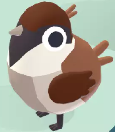|
|6|동물|뱀|Snake|첫째 세이브 포인트부터 두번째 세이브 포인트 전까지|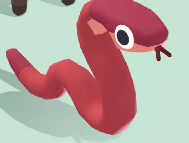|
|7|동물|양|Sheep|두번째 세이브 포인트부터 세번째 세이브 포인트 전까지|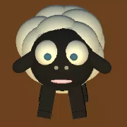|
|8|동물|원숭이|Monkey|세번째 세이브 포인트부터 네번째 세이브 포인트 전까지|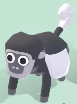|
|9|동물|물고기|Fish|네번째 세이브 포인트부터 다섯번째 세이브 포인트 전까지|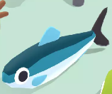|
|10|UI|플레이어초상화|PlayerUI|화면 왼쪽 하단에 플레이어 캐릭터의 초상화를 보여줌|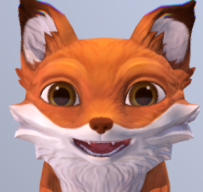|
|11|UI|동료동물 초상화|FriendsUI|화면 왼쪽 상단에 구출한 동물들의 초상화를 보여줌|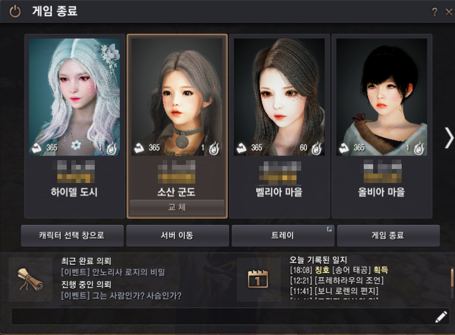|
|12|장애물|높은 벽|TallWall|첫 세이브 포인트 전까지||
|13|장애물|좁은 길|TightRoad|첫째 세이브 포인트부터 두번째 세이브 포인트 전까지||
|14|장애물|깊은낭떠러지|DeepCliff|두번째 세이브 포인트부터 세번째 세이브 포인트 전까지|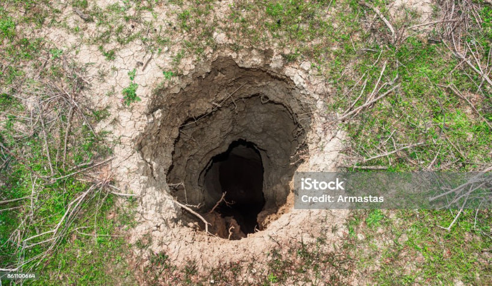|
|15|장애물|정글짐|JungleGym|세번째 세이브 포인트부터 네번째 세이브 포인트 전까지|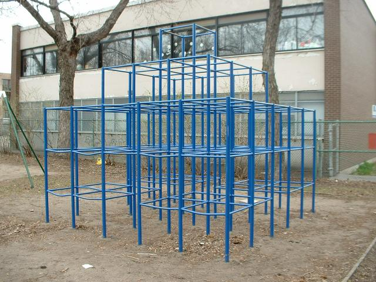|
|16|장애물|바다|Sea|네번째 세이브 포인트부터 다섯번째 세이브 포인트 전까지|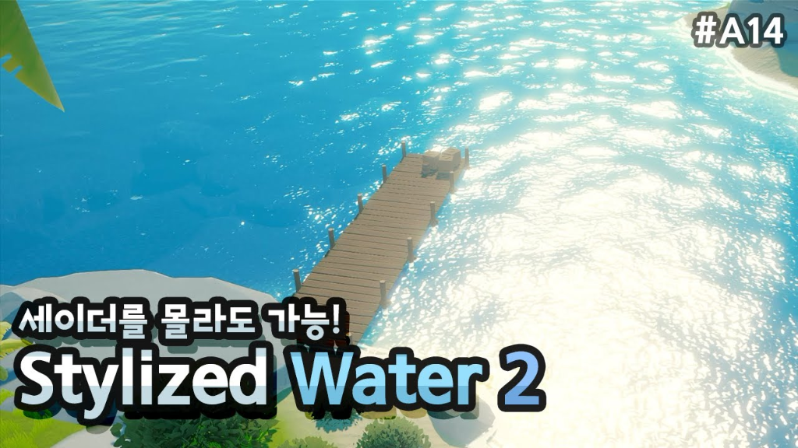|
|17|장애물|철퇴|IronBall|맵 중간중간 튀어나오는 장애물|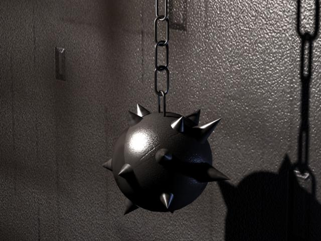|
|18|장애물|선풍기|Fan|첫 세이브포인트 전까지||

## 2.파라미터(속성) 뽑아 보기

1)오브젝트 이름: Miho 외 동료동물 8마리

|속성|영문명칭|설명|비고|
|------|---|---|---|
|속성|영문명칭|설명|비고|
|목숨|Life|캐릭터의 기회||
|상태|state|플레이어의 행동 상태, 이동, 사망||

2)오브젝트이름: Obstacle(장애물)

|속성|영문명칭|설명|비고|
|------|---|---|---|
|활성화|activation|기본적인 함정과 장애물의 동작상태||
|비활성화|inactivation|레버 등을 이용하여 장애물이나 함정의 작동이 중지된 상태||

3)오브젝트 이름: SavePoint(저장지점)

|속성|영문명칭|설명|비고|
|------|---|---|---|
|활성화|activation|Player 오브젝트와 충돌하여 저장기능이 활성화된 상태||
|비활성화|inactivation|Save 기능이 작동하기 전 기본상태||

4)오브젝트 이름: 지형지물

|속성|영문명칭|설명|비고|
|------|---|---|---|
|1번 지형구조|topographic features 1|첫 번째 지형. 높은 고지대 지형|특정 동물을 이용해야함|
|2번 지형구조|topographic features 2|두 번째 지형. 천장이 낮고 좁은 지형|특정 동물을 이용해야함|
|3번 지형구조|topographic features 3|세 번째 지형. 점프로 올라갈 수 없는 벽을 타고 올라가야하는 높이의 지형|특정 동물을 이용해야함|
|4번 지형구조|topographic features 4|네 번째 지형. 수중지형|특정 동물을 이용해야함|
|5번 지형구조|topographic features 5|다섯 번째 지형. 지반이 약하여 땅이 내려앉는 지형|특정 동물을 이용해야함|
|6번 지형구조|topographic features 6|여섯 번째 지형. 남극분위기가 나는 빙판지형|특정 동물을 이용해야함|

## 3.행동 뽑아보기

1)오브젝트 이름: 플레이어 캐릭터

|행동|영문명칭|설명|
|------|---|---|
|가만히있음|Stand|아무 행동도 하지 않는 모습|
|앞으로 이동|Forward|W 또는 윗 방향키 입력 시 해당 방향으로 이동|
|뒤로 이동|Back|S 또는 아래 방향키 입력 시 해당 방향으로 이동|
|왼쪽으로 이동|Left|A 또는 왼쪽 방향키 입력 시 해당 방향으로 이동|
|오른쪽으로 이동|Right|D 또는 오른쪽 방향키 입력 시 해당 방향으로 이동|
|점프|Jump|Spacebar 입력 시 1의 높이만큼 점프|
|특성|Characteristic|R키 입력 시 동물마다 특성 발휘|

## 4.상태 뽑아보기

1)오브젝트 이름:Miho

|현상태|전이상태|전이조건|
|------|---|---|
|Stand(가만히 서 있는 상태)|Walk(정면으로 이동)|방향키 또는 W,A,S,D를 입력하였을 때|
|Stand(가만히 서 있는 상태)|Unlock(동료동물 구출)	|동료동물이 갇혀있는 방문 앞에서 상호작용 키를 눌러 작용함|
|Stand(가만히 서 있는 상태)|Dialogue(동료동물과 대화)|동료 동물을 발견 or 구출했을 때|
|Stand(가만히 서 있는 상태)|Jump(점프)|Stand 또는 Walk일 때 점프키 입력 시|
|Stand(가만히 서 있는 상태)|Characteristic(특성)|R키 입력시 동물이 특성을 사용|
|Stand(가만히 서 있는 상태)|Die(사망)|함정에 충돌했을 때|
|Walk(정면으로 이동)|Die(사망)|함정에 충돌했을 때|
|Walk(정면으로 이동)|Characteristic(특성)|R키 입력시 동물이 특성을 사용함|
|Die(사망)|Stand(가만히 서 있는 상태)|사망 후 일정시간 이후|

## 5.플레이어 캐릭터 속성(파라미터)

|속성|영문명칭|설명|비고|
|------|---|---|---|
|둔갑형|Disappearing|Miho 다른 동물들로 변신할 수 있다.||
|크랙형|Cracl|Snake 천장이 낮고 좁은 틈을 이동할 수 있다.||
|공중형|Fly|Bird 점프로 올라가지 못하는 높은 지대를 올라갈 수 있다.||
|스피드형|Speed|Deer 지반이 약한 구간을 빠르게 이동할 수 있다.||
|곡예형|Parkour|Monkey 지형지물을 타고 이동해야 하는 구간을 지날때 벽을 탄다||
|수중형|Aqua|Fish 물 속에서 자유롭게 이동 가능하다.||
|슬라이드형|Slide|Penguin 빙판 위를 자유롭게 이동 가능하다.||

## 6.게임의 규칙

1) 핵심 규칙 유저는 기본적으로 Miho라는 여우 캐릭터로 구성됨. 외딴섬 박사 실험실의 각종 장애물과 함정을 피해 이동하며, 다른 동 실험실에 갇혀있는 동물들을 구출. 구출한 동물들로 Miho가 변신을 할 수 있게되며 변신한 동물 캐릭터들 또한 유저의 play캐릭터로 동일함. 구출한 동물들은 각각의 동물 특성을 가지고 있으며, 박사 실험실에서 탈출 시에 나오는 각종 지형지물과 함정을 통과하는데 필요한 특성으로 구성되어있음. 지형의 특징을 잘 파악하여 지형을 통과하는데 용이한 동물의 특성을 이용해야함. 플레이하는 중간마다 SavePoint가 있으며 사망시 마지막 SavePoint로 이동하게 됨. 맵 중간마다 나오는 코인을 먹으면 재시도 할 수 있는 Life를 획득하게 됨. 모든 Life 소진시 게임을 처음부터 재시작 해야함.

2) 보조 규칙 모든 동물을 수집해야만 클리어 가능.

## 7.게임에서 사용될 공식

1)동물 구출 이벤트

-1.타이밍 노트의 체크칸에 맞추어 Space키를 입력한다.

-2.타이밍을 맞춰 체크칸에 Space키를 눌렀다면 다음 잠금이벤트로 넘어간다.

-3.비밀번호 칸에 해당 동물의 영문이름을 입력한다

-4.알맞게 입력했다면 구출에 성공하고 Dialogue가 나오며 Miho의 변신가능 동물 리스트에 추가된다.

2)함정 이벤트

-1.player캐릭터가 함정과 충돌함.

-2.OnTriggerEnter에서 충돌을 판단 후 동물은 사망상태로 전환됨.

-3.사망하게되면 일정 시간 후 부활함

-1.함정을 비활성화 시키는 오브젝트를 입력

-2.함정이 false로 변환되며 작동을 중지함

3)지형지물 이벤트

-1.지반이 약한 지형 입장시 일정 위치를 지나면 센서에 입력됨

-2.일정 시간 이후부터 지반이 아래로 무너져내리기 시작함

-3.지반이 완전히 무너진 상태에서 동물이 사망한 상태라면 부활과 함께 복구됨

-1.빙판을 입장시 입장시 동물의 Tag값 비교

-2.펭귄외의 동물이 입장할 시 “너무 추워서 난 못 가겠어”라는 Dialogue를 출력하며 Drag값을 1로 증가시킴

-3.빙판길 직전 위치로 이동함 -4.펭귄이 빙판길 입장 후 특성을 발휘하게 될 시 Drag값을 0으로 설정함

-1.수중지형에 입장시 동물의 Tag값 비교

-2.수중형 속성외의 동물이 입장시 “난 수영 못해 살려줘”라는 Dialogue출력 후 Life-=1

-3.수중형 속성의 동물이 입장시 수중 속 Enemy가 쫓아오게 됨

-4.수중형 속성의 동물의 특성을 이용하여 Enemy에 적중하게되면 Enemy는 그로기 상태 또는 도망을 치게 됨

-5.적중하지 못하고 Enemy에게 충돌할 시 Life-=1 후 일정시간 이후 마지막 세이브 장소로 이동

[목차](#목차)

# 개발 요구사항 & 흐름도 <a name ='6'><a/>

## NinetailFoxAdventure의 요구사항 (1년차)  

### 1. 플레이어 요구사항

1-1 게임 진행중 게임화면 중간하단에 Dialogue창이 나오고 F키를 이용하여 넘어갈 수 있다.

1-2 게임 진행중 Life아이템이 나오는데, 프로틴통 모양의 오브젝트로 맵 곳곳에 배치되어있다. Life 오브젝트에 가까이 가서 F키로 상호작용시 Life가 1증가되고, 오브젝트는 사라진다.

1-3 함정에 충돌시 사망하며 Life가 1 감소된다.

1-4 깊은 낭떠러지는 양으로 떨어지지 않을 경우, 사망하며 Life가 1 감소된다.

1-5 바다는 수중형 속성을 가진 동료 동물(오징어)만 지나갈 수 있으며,  그 외 속성의 동물로 들어갈 시 사망하며 Life가 1감소한다.

1-6 바다 속 장애물로 상어가 존재하며 R키로 오징어의 특성을 이용하여 먹물을 쏴 명중시 무력화 시킨다.

1-7 약한 지반 지형지물은 플레이어가 지나갈시 일정 시간 이후에 지반이 무너지기 시작한다.

1-8 약한 지반 지형지물을 지나갈 때는 스피드형 속성을 가진 동물(사슴)을 이용하여 지나갈 수 있다.

1-9 빙판 지형지물은 슬라이드형 속성(펭귄)을 가진 동료동물 지나갈 수 있으며 다른 동물로 입장할 시 Drag값이 증가하여 움직일 수 없으며 '추워서 못가겠어' 라는 Dialogue가 출력된다.

1-10 정글짐 장애물은 곡예형 속성을 가진 동료 동물(원숭이)의 특성을 이용하여야만 넘어갈 수 있다.

1-11 좁고 낮은 길은 크랙형 속성을 가진 동료동물(뱀)을 이용해야만 지나갈 수 있다.

1-12 리스트에 추가된 동물로 둔갑하여 게임을 진행 할 수 있다.

1-13 사망 후 남은 Life가 0이라면 게임의 처음으로 되돌아가게 되며, 남은 Life의 개수가 0을 초과한다면 마지막 SavePoint로 이동하게된다.

1-14 조작은 키보드 상하좌우 화살표로 이동, Spacebar 점프

1-15 F키는 오브젝트 상호작용 및 Dialouge진행, R키는 동료특성사용, 키보드 상단 넘버키로 동료동물로 둔갑 할 수 있다.

### 2. 장애물/함정 요구사항

2-1 장애물과 함정, 특정지형지물로는 높은 벽, 좁고 낮은 길, 깊은 낭떠러지, 정글짐, 바다, 철퇴, 선풍기, 빙판길, 약한지반, 상어가 있다.

2-2 철퇴 함정은 맵 중간중간 등장하며 진자운동을 하며 길을 막고 있으며 플레이어와 충돌시 사망하며 Life가 1 감소한다.

2-3 선풍기 장애물은 강한 바람을 일으켜 플레이어를 일정 방향으로 밀어낸다.

2-4 철퇴 함정 주변에는 레버 오브젝트가 존재하며 F키를 이용해 플레이어가 상호작용하여 철퇴의 작동을 멈출 수 있다.

2-5 선풍기 장애물 주변에는 레버 오브젝트가 존재하며 F키를 이용해 플레이어가 상호작용하여 선풍기의 작동을 멈출 수 있다.

2-6 게임 진행중 다음 구역으로 넘어가기 전 닫혀있는 문은 문 옆의 버튼 오브젝트에 F키로 상호작용하여 열 수 있다.

### 3. 게임 시스템 요구사항

3-1 시작화면, 게임화면 총 2개의 화면이 있다.

3-2 시작화면에는 시작하기 버튼 1개가 있다.

3-3 시작하기 클릭 시 게임화면으로 이동한다.

3-4 플레이어가 SavePoint존에 들어가게되면 현재 SavePoint의 Position값과 구출한 동료가 저장된다.

3-5 사운드 조절은 0에서 100까지 조절 가능하며 음소거ON/OFF 기능이 있다.

3-6 게임종료 버튼 클릭시 '현재 진행된 부분까지 저장됩니다'라는 팝업이 표시되며 확인 버튼을 누르면 게임이 저장된다.

3-7 게임 종료시 Dialogue와 이미지가 나오며 엔딩장면이 나온다.

3-8 게임 진행 중 ESC키를 누르면 환경설정 창이 나온다.

3-9 동료를 구출하기 위해 문 앞에서 F키를 이용하여 상호작용하게 되면 타이밍체크 팝업창이 뜨게되며 Space바를 이용해 일정한 칸에 맞추게 되면 타이밍체크 팝업창이 꺼지고 비밀번호 팝업창이 뜬다.

3-10 게임의 종료 조건은 모든 동료를 구출 후 박사의 실험실에서 탈출하면 종료된다.

### 4. UI 요구사항

4-1 게임화면에는 왼쪽 하단에 플레이어 초상화, 왼쪽상단에 동료초상화, 우측상단에 Life가 있다.

4-2 비밀번호 팝업창은 갇혀있는 동물의 영어 이름을 입력한 후 확인 버튼을 누르면 팝업창이 닫히게되고 동료 동물 리스트에 추가된다.

4-3 환경설정 창이 표시되어 있는 경우 돌아가기 버튼을 누르거나 ESC키를 재입력하면 환경설정 창이 닫힌다.

4-4 조작법을 누르면 게임 내에서 사용 가능한 키보드 입력 값과 설명팝업이 화면에 표시된다.

4-5 환경설정 창에서는 사운드 조절과 게임종료, 돌아가기, 조작법을 보여준다.

### 5.맵 디자인 요구사항
5-1 스테이지 첫 번째 테마인 실험실 레벨디자인을 에셋을 활용하여 구현한다.

### 6. 기타 요구사항

6-1 게임을 진행할때마다 함정이 자주 등장한다.

6-2 게임 진행중 마법진모양포탈의 모양으로 SavePoint가 맵 곳곳에 등장한다.

[목차](#목차)

## NinetailFoxAdventure의 요구사항 (6주차) 
### 1주차

1-1 ~~시작화면, 게임화면 총 2개의 화면이 있다.~~ (3-1 임형균) 100%

1-2 ~~시작화면에는 시작하기 버튼 1개가 있다.~~ (3-2 임형균) 100%

1-3 ~~시작하기 클릭 시 게임화면으로 이동한다.~~ (3-3 임형균) 100%

1-4 ~~Plastic SCM으로 프로젝트 공유하기~~ (이승현) 100%

### 2주차

2-1 ~~조작은 키보드 상하좌우 화살표로 이동, Spacebar 점프 (1-14 임형균)~~ 100%

2-2 ~~게임 진행 중 ESC키를 누르면 환경설정 창이 나온다. (3-8 이승현)~~ 100%

2-3 ~~환경설정 창이 표시되어 있는 경우 돌아가기 버튼을 누르거나 ESC키를 재입력하면 환경설정 창이 닫힌다. (4-3 이승현)~~ 100%

2-4 ~~조작법을 누르면 게임 내에서 사용 가능한 키보드 입력 값과 설명팝업이 화면에 표시된다. (4-4 이승현)~~ 100%

2-5 ~~환경설정 창에서는 사운드 조절과 게임종료, 돌아가기, 조작법을 보여준다. (4-5 이승현)~~ 100%

2-6 ~~게임종료 버튼 클릭시 '현재 진행된 부분까지 저장됩니다'라는 팝업이 표시되며 확인 버튼을 누르면 게임이 저장된다. (3-6 임형균)~~ 100%

### 3주차

3-1 ~~함정에 충돌시 사망하며 Life가 1 감소된다.~~ (1-3 임형균) 100%

3-2 ~~사망 후 남은 Life가 0이라면 게임의 처음으로 되돌아가게 되며, 남은 Life의 개수가 0을 초과한다면 마지막 SavePoint로 이동하게된다.~~ (1-13 임형균) 100%

3-3 ~~플레이어가 SavePoint존에 들어가게되면 현재 SavePoint의 Position값과 구출한 동료가 저장된다.~~ (3-4 이승현) 100%

3-4 ~~F키로 오브젝트 상호작용 (임형균)~~ 100%

3-5 ~~게임 진행중 Life아이템이 나오는데, 프로틴통 모양의 오브젝트로 맵 곳곳에 배치되어있다. Life 오브젝트에 가까이 가서 F키로 상호작용시 Life가 1증가되고, 오브젝트는 사라진다.~~ (1-2 이승현,임형균) 100%

### 4주차

4-1 ~~사운드 조절은 0에서 100까지 조절 가능하며 음소거ON/OFF 기능이 있다.~~ (3-5 이승현) 100%

4-2 ~~선풍기 장애물은 강한 바람을 일으켜 플레이어를 일정 방향으로 밀어낸다.~~ (2-3 이승현) 100%

4-3 ~~게임화면에는 왼쪽 하단에 플레이어 초상화, 왼쪽상단에 동료초상화, 우측상단에 Life가 있다.~~ (4-1 임형균) 100%

4-4 ~~1스테이지 컨셉인 실험실 레벨디자인을 에셋을 활용하여 구현한다.~~ (4-2 이승현) 100%

4-5 ~~동료를 구출하기 위해 문 앞에서 F키를 이용하여 상호작용하게 되면 타이밍체크 팝업창이 뜨게되며 Space바를 이용해 일정한 칸에 맞추게 되면 타이밍체크 팝업창이 꺼지고 비밀번호 팝업창이 뜬다.~~ (3-9 임형균) 100%

4-6 ~~카메라를 캐릭터 백 쿼터뷰 시점으로 고정시키는 기능을 구현한다.~~ (임형균) 100%

### 5주차

5-1 비밀번호 팝업창은 갇혀있는 동물의 영어 이름을 입력한 후 확인 버튼을 누르면 팝업창이 닫히게되고 동료 동물 리스트에 추가된다. (4-2 임형균)

5-2 철퇴 함정은 맵 중간중간 등장하며 진자운동을 하며 길을 막고 있으며 플레이어와 충돌시 사망하며 Life가 1 감소한다. (2-2 이승현, 임형균)

5-3 철퇴 함정 주변에는 레버 오브젝트가 존재하며 F키를 이용해 플레이어가 상호작용하여 철퇴의 작동을 멈출 수 있다. (2-4 이승현, 임형균)

5-4 선풍기 장애물 주변에는 레버 오브젝트가 존재하며 F키를 이용해 플레이어가 상호작용하여 선풍기의 작동을 멈출 수 있다. (2-5 이승현, 임형균)

### 6주차

6-1 게임 진행중 다음 구역으로 넘어가기 전 닫혀있는 문은 문 옆의 버튼 오브젝트에 F키로 상호작용하여 열 수 있다. (2-6 이승현, 임형균)

6-2 리스트에 추가된 동물로 둔갑하여 게임을 진행 할 수 있다. (1-12 임형균)

6-3 1스테이지 레벨 디자인을 완성시킨다.

## 2. 시간별 흐름도 flowchart <a name ='7'><a/>
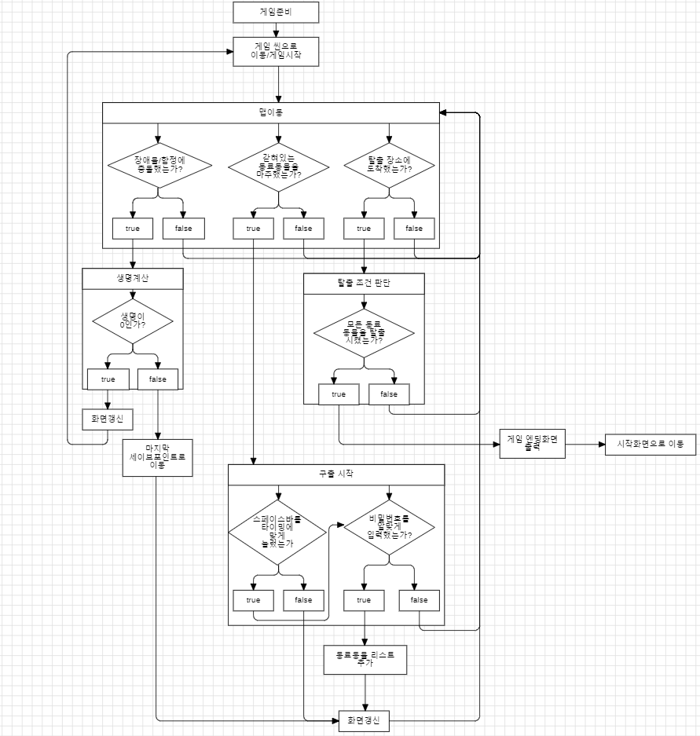

[목차](#목차)

## 3. 키보드 이벤트에 대한 흐름도 <a name ='8'><a/>
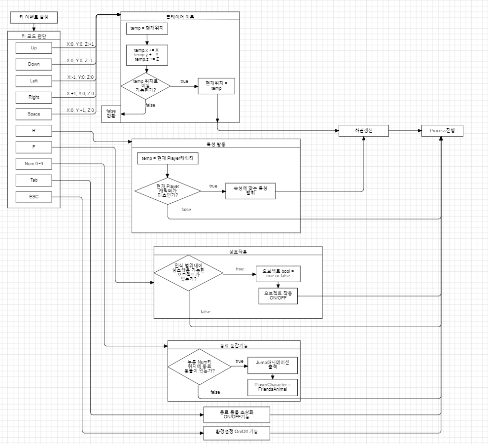

[목차](#목차)

## 4. 용어정리 <a name ='9'><a/>

|No|화면||용어|설명|
|---|----|---|---|---|
|1|Index(시작화면)|||NineTailFox 게임 시작화면이다. 시작하기 버튼이 있다.|
|2|Index(시작화면)|화면요소|타이틀|NineTailFox 게임의 타이틀이다.|
|3|Index(시작화면)|화면요소|시작하기|클릭 시 게임화면으로 이동한다.|
|4|Play(게임화면)|||실제 NineTailFox 게임을 하는 화면이다. 플레이어 초상화, 플레이어 캐릭터, 플레이어 목숨이 있다.|
|5|Play(게임화면)|화면요소|플레이어 초상화|왼쪽 하단에 플레이어 캐릭터의 초상화가 나타나는 UI이다. 플레이어가 선택한 동물에 알맞게 초상화가 변경된다.|
|6|Play(게임화면)|화면요소|플레이어 캐릭터|화면 중앙에 플레이어가 직접 조작할 수 있는 오브젝트이다. 플레이어가 입력하는 키에 알맞은 행동을 한다.|
|7|Play(게임화면)|화면요소|플레이어 목숨|오른쪽 상단에 프로틴통 모양의 오브젝트로 목숨을 나타내준다.|
|8|Play(게임화면)|스크립트요소|키코드|총 19가지의 키코드(방향키,스페이스바,num0~9,tab,esc,f,r)가 있다.|
|9|Play(게임화면)|스크립트요소|Up|위 방향키 코드 38이다.|
|10|Play(게임화면)|스크립트요소|Down|아래 방향키 코드 40이다.|
|11|Play(게임화면)|스크립트요소|Left|왼쪽 방향키 코드 37이다.|
|12|Play(게임화면)|스크립트요소|Right|오른쪽 방향키 코드 39이다.|
|13|Play(게임화면)|스크립트요소|Space|스페이스 바 코드 32이다.|
|14|Play(게임화면)|스크립트요소|esc|esc키 코드 27이다.|
|15|Play(게임화면)|스크립트요소|Num0|동물 둔갑 기능버튼이다. 코드 Alpha0이다.|
|16|Play(게임화면)|스크립트요소|Num1|동물 둔갑 기능버튼이다. 코드 Alpha1이다.|
|17|Play(게임화면)|스크립트요소|Num2|동물 둔갑 기능버튼이다. 코드 Alpha2이다.|
|18|Play(게임화면)|스크립트요소|Num3|동물 둔갑 기능버튼이다. 코드 Alpha3이다.|
|19|Play(게임화면)|스크립트요소|Num4|동물 둔갑 기능버튼이다. 코드 Alpha4이다.|
|20|Play(게임화면)|스크립트요소|Num5|동물 둔갑 기능버튼이다. 코드 Alpha5이다.|
|21|Play(게임화면)|스크립트요소|Num6|동물 둔갑 기능버튼이다. 코드 Alpha6이다.|
|22|Play(게임화면)|스크립트요소|Num7|동물 둔갑 기능버튼이다. 코드 Alpha7이다.|
|23|Play(게임화면)|스크립트요소|Num8|동물 둔갑 기능버튼이다. 코드 Alpha8이다.|
|24|Play(게임화면)|스크립트요소|Num9|동물 둔갑 기능버튼이다. 코드 Alpha9이다.|
|25|Play(게임화면)|스크립트요소|Tab|현재 보유하고 있는 동물들을 담고 있는 Canvas를 띄워주는 키이다. 코드 Tab이다.|
|26|Play(게임화면)|스크립트요소|R|캐릭터의 스킬을 사용하는 키이다. 코드 ‘r’이다.|
|27|Play(게임화면)|스크립트요소|F|맵 내부의 오브젝트와 상호작용하는 키이다. 코드 ‘f’이다|
|28|Play(게임화면)|스크립트요소|curLife|캐릭터의 목숨 개수를 나타내는 변수이다.|
|29|Play(게임화면)|스크립트요소|friends|구출한 동료 동물들을 저장하는 배열이다.|
|30|Play(게임화면)|스크립트요소|speed|플레이어의 속도를 나타내는 변수이다.|
|31|Play(게임화면)|스크립트요소|jump|플레이어의 점프를 담당하는 변수이다.|
|32|Play(게임화면)|스크립트요소|disappearing|Miho가 다른 동물로 변신 할 수 있는 속성변수이다.|
|33|Play(게임화면)|스크립트요소|crack|Snake가 낮고 좁은 틈을 이동 할 수 있는 속성변수이다.|
|34|Play(게임화면)|스크립트요소|fly|Bird가 점프로 올라가지 못하는 지형을 올라갈 수 있는 속성변수이다.|
|35|Play(게임화면)|스크립트요소|deerSpeed|Deer가 빠르게 이동해야 하는 구간을 통과할 수 있는 속성변수이다.|
|36|Play(게임화면)|스크립트요소|parkour|Monkey가 지형지물을 타고 이동해야 하는 구간을 통과할 수 있는 속성변수이다.|
|37|Play(게임화면)|스크립트요소|aqua|Fish가 물 속에서 이동할 수 있는 속성변수이다.|
|38|Play(게임화면)|스크립트요소|slide|Penguin이 빙하 지형을 이동할 수 있는 속성변수이다.|
|39|Play(게임화면)|스크립트요소|savePos|캐릭터의 위치를 저장하는 변수이다.|
|40|Play(게임화면)|스크립트요소|playerUI|현재 플레이중인 캐릭터의 초상화를 보여주는 변수이다.|
|41|Play(게임화면)|스크립트요소|friendsUI|구출한 동료 동물 초상화를 저장시켜주는 오브젝트 변수이다.|
|42|Play(게임화면)|스크립트요소|wind|선풍기 장애물의 바람을 저장하는 오브젝트 변수이다.|
|43|Play(게임화면)|스크립트요소|trapSpeed|장애물 오브젝트의 속도 변수이다.|
|44|Play(게임화면)|스크립트요소|isActive|장애물이 작동하는지 안 하는지 결정하는 bool형 변수이다.|
|45|Play(게임화면)|스크립트요소|noteCheck|노트 타이밍이 맞았는지 틀렸는지 결정하는 bool형 변수이다.|
|46|Play(게임화면)|스크립트요소|rotateSpeed|노트 시스템의 checkLine의 회전속도를 나타내는 변수이다.|
|47|Play(게임화면)|스크립트요소|password|동물 구출시 필요한 암호를 저장하는 오브젝트 배열이다.|

[목차](#목차)

# [스토리보드] <a name ='10'><a/>
시네마 이벤트 #1

실험실에 누워있는 여우를 중심으로 카메라가 실험실 내부를 보여주고 있다.

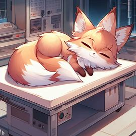

인 게임 -1

여우가 동물을 구출해 내는 모습을 보여주고 있다.

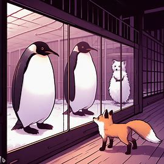

인게임 –2

여우가 다른 동료 동물로 둔갑하는 모습을 보여주고 있다.

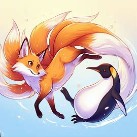

인 게임 –3

구출한 동료 동물 펭귄으로 변신하여 빙판 장애물을 지나가는 모습을 보여주고 있다.

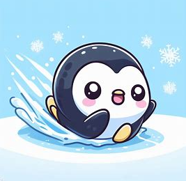

시네마 이벤트 #2

여우와 다른 동료 동물들이 탈출에 성공해서 기뻐하는 모습을 보여주고 있다.

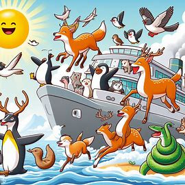

[목차](#목차)

# [Github Blog URL] <a name ='11'><a/>
이승현 : lseunghyun.github.io / 임형균 : LimHyeongGyun.github.io

[목차](#목차)

# [6주 요구사항 작업결과] <a name ='12'><a/>

## 1주차 작업결과

작업 명 : 게임에 필요한 씬 구성

해당 요구사항 : 

1-1 시작화면, 게임화면 총 2개의 화면이 있다. (100%)

1-2 시작화면에는 시작하기 버튼 1개가 있다. (100%)

1-3 시작하기 클릭 시 게임화면으로 이동한다. (100%)

1-4 Plasic SCM을 활용하여 공동작업이 유용하도록 하였다. (100%)

작업 내용 : Start씬과 Game씬을 만들어주었으며, 시작화면에 시작하기 버튼 1개를 생성해 주었다.

시작하기 버튼을 클릭할시 페이드 아웃이 진행되며 페이드아웃 진행 후 게임화면으로 이동하도록 하였다.

## 2주차 작업결과

작업명: 플레이어 조작과 환경설정

해당 요구사향:

2-1 조작은 키보드 상하좌우 화살표로 이동, Spacebar 점프 (1-14 임형균) (100%)

2-2 게임 진행 중 ESC키를 누르면 환경설정 창이 나온다. (3-8 이승현) (100%)

2-3 환경설정 창이 표시되어 있는 경우 돌아가기 버튼을 누르거나 ESC키를 재입력하면 환경설정 창이 닫힌다. (4-3 이승현) (100%)

2-4 조작법을 누르면 게임 내에서 사용 가능한 키보드 입력 값과 설명팝업이 화면에 표시된다. (4-4 이승현) (100%)

2-5 환경설정 창에서는 사운드 조절과 게임종료, 돌아가기, 조작법을 보여준다. (4-5 이승현) (100%)

2-6 게임종료 버튼 클릭시 '현재 진행된 부분까지 저장됩니다'라는 팝업이 표시되며 확인 버튼을 누르면 게임이 저장된다. (3-6 임형균) (100%)

작업 내용 : 플레이어 오브젝트의 이동을 구현하였고, ESC키를 통해 환경설정창이 나오도록 구현하였다.

## 3주차 작업결과

작업명: 플레이어 상호작용 구현
 
해당요구사항 : 

3-1 함정에 충돌시 사망하며 Life가 1 감소된다. (1-3 임형균) (100%)

3-2 사망 후 남은 Life가 0이라면 게임의 처음으로 되돌아가게 되며, 남은 Life의 개수가 0을 초과한다면 마지막 SavePoint로 이동하게된다. (1-13 임형균) (100%)

3-3 플레이어가 SavePoint존에 들어가게되면 현재 SavePoint의 Position값과 구출한 동료가 저장된다. (3-4 이승현) (100%)

3-4 F키로 오브젝트 상호작용 (임형균) (100%)

3-5 게임 진행중 Life아이템이 나오는데, 프로틴통 모양의 오브젝트로 맵 곳곳에 배치되어있다. Life 오브젝트에 가까이 가서 F키로 상호작용시 Life가 1증가되고, 오브젝트는 사라진다. (1-2 이승현,임형균) (100%)

작업 내용 : Obstacle과 Life 오브젝트를 구현하였고, Obstacle과 충돌하면 Life -1, Life 오브젝트를 F키로 상호작용하여 획득하면 Life +1이 되도록 구현하였다.
            SavePoint를 구현하여 함정에 부딪혀 사망처리 되었을때 캐릭터의 남은 Life가 1이상이라면 SavePoint에서 부활하도록 구현하였다. 

## 4주차 작업결과

해당 요구사항:

4-1 사운드 조절은 0에서 100까지 조절 가능하며 음소거ON/OFF 기능이 있다. (3-5 이승현) (100%)

4-2 선풍기 장애물은 강한 바람을 일으켜 플레이어를 일정 방향으로 밀어낸다 (2-3 이승현) (100%)

4-3 게임화면에는 왼쪽 하단에 플레이어 초상화, 왼쪽상단에 동료초상화, 우측상단에 Life가 있다. (4-1 임형균) (100%)

4-4 1스테이지 컨셉인 실험실 레벨디자인을 에셋을 활용하여 구현한다. (4-2 이승현) (100%)

4-5 동료를 구출하기 위해 문 앞에서 F키를 이용하여 상호작용하게 되면 타이밍체크 팝업창이 뜨게되며 Space바를 이용해 일정한 칸에 맞추게 되면 타이밍체크 팝업창이 꺼지고 비밀번호 팝업창이 뜬다. (3-9 임형균) (100%)

4-6 카메라를 캐릭터 백 쿼터뷰 시점으로 고정시키는 기능을 구현한다. (임형균) (100%)

작업 내용 : 사운드On,Off 기능과 사운드조절 Slider 구현하였다. 선풍기 장애물을 구현하여 플레이어 오브젝트가 선풍기 앞을 지나가면 선풍기의 반대방향으로 밀려나도록 구현하였다. 인게임 Canvas를 구현하여 왼쪽 하단에 현재 플레이어 캐릭터의 초상화가 보여지도록 구현하였고, 왼쪽상단에는 현재 보유중인 동료초상화가 보여지도록 구현하였다. 우측상단에는 현재 플레이어 캐릭터의 목숨갯수가 보여지도록 구현하였다. 첫 테마 컨셉인 실험실을 에셋을 활용하여 레벨디자인하였고, 동료를 구하기 위한 퍼즐(타이밍체크,비밀번호 입력) 기능을 구현하였다. 카메라의 시점이 플레이어 캐릭터의 백 쿼터뷰 시점으로 고정되도록 구현하였다.

## 5주차 작업결과

작업명 : 장애물과 비밀번호 시스템 구현하기

5-1 비밀번호 팝업창은 현재 플레이어 캐릭터가 존재하는 동, 호수의 숫자를 순서대로 입력한 후 확인 버튼을 누르면 팝업창이 닫히게되고 동료 동물 리스트에 추가된다.(4-2 임형균) (100%)

5-2 철퇴 함정은 맵 중간중간 등장하며 진자운동을 하며 길을 막고 있으며 플레이어와 충돌시 Life가 1 감소한다. (2-2 이승현, 임형균) (100%)

5-3 철퇴 함정 주변에는 레버 오브젝트가 존재하며 F키를 이용해 플레이어가 상호작용하여 철퇴의 작동을 멈출 수 있다. (2-4 이승현, 임형균) (100%)

5-4 선풍기 장애물 주변에는 레버 오브젝트가 존재하며 F키를 이용해 플레이어가 상호작용하여 선풍기의 작동을 멈출 수 있다. (2-5 이승현, 임형균) (100%)

5-5 레벨 디자인 추가 및 장애물 설치하기(이승현) (100%)

5-6 대표이미지 캡처하여 깃허브에 추가하기(이승현) (100%)

작업 내용 : 비밀번호 팝업창의 내부 기능을 구현하였고, 구출한 동물이 인게임 왼쪽 상단 UI에 추가되도록 구현하였다. 진자 운동을 하는 철퇴 함정을 구현하였고, 모든 함정 주변에 함정을 끌 수 있는 레버를 제작하여 F키로 상호작용하면 함정의 작동을 멈출 수 있게 구현하였다. 대표이미지를 캡쳐하여 깃허브블로그에 추가하였다.

## 6주차 작업결과

작업명 : 둔갑기술 및 발표준비

6-1 게임 진행중 다음 구역으로 넘어가기 전 닫혀있는 문은 문 옆의 버튼 오브젝트에 F키로 상호작용하여 열 수 있다. (2-6 이승현, 임형균) (100%)

6-2 리스트에 추가된 동물로 둔갑하여 게임을 진행 할 수 있다. (1-12 임형균) (100%)

6-3 대표이미지 가져오기 (100%)

작업 내용 : 각 테마의 경계에 문을 구현하여 상호작용키로 열 수 있는 문을 구현하였다. 구미호의 능력인 둔갑 기술을 구현하여 구출한 동물을 숫자키를 통해 변신할 수 있게 구현하였다.

## 6주차 이후 추가 작업결과

작업명 : 시작화면 구현 및 게임 퀄리티 향상, 버그 수정

1 게임 시작 화면 구현 (이승현) 100%
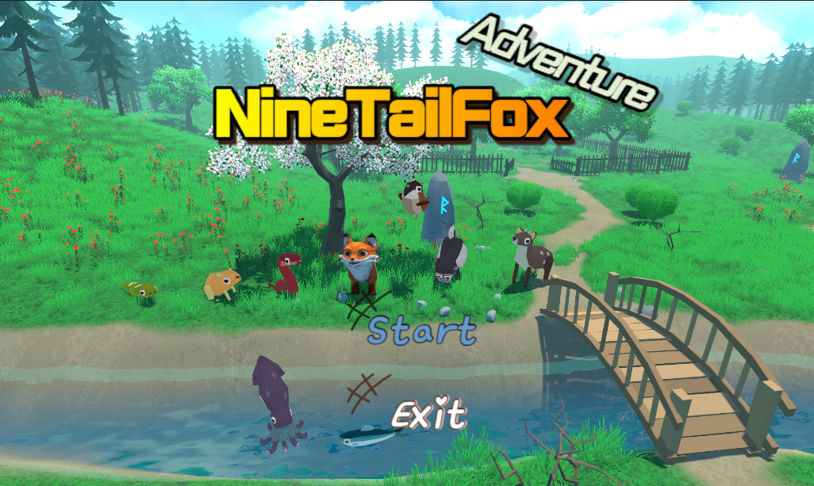

2 인게임 UI 제작 (이승현) 100%

[목차](#목차)
