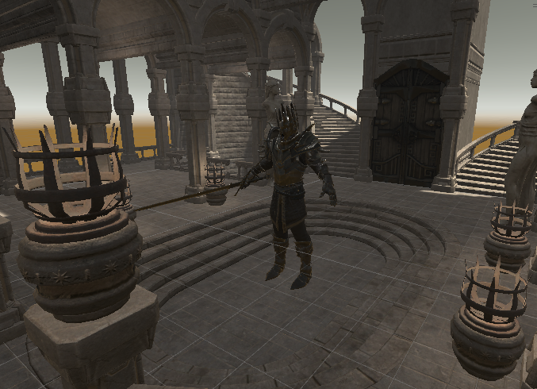

# LimHyeongGyun.github.io

# Ancient Ruins (임형균, 이승)

# [ 목차 ]
### 1. [개발 업무 담당](#1)
### 2. [게임개요](#2)
### 3. [게임 시스템](#3)
### 4. [플레이어 ](#4)
### 5. [몬스터](#5)
### 6. [대표이미지](#6)
### 7. [Github Blog URL](#7)

## 1. [개발 업무 담당] 
* 임형균 : 프로그래밍, 기획, UI, 그래픽요소  
* 이승현 : 프로그래밍, 컷씬, GitHub문서화

[목차](#목차)
   
## 2. [게임개요]   
### 1) 게임장르
소울라이크류 게임 ex)다크소울, 엘든링, 세키로, 블러드본 등  
### 2) 게임컨셉
떠돌이 용병 생활을 하던 주인공이 유적을 발견하고 유적을 지키는 마물을 물리치며 탐사하는 소울라이크 액션게임
### 3) 게임스토리
주인공 '마크 루인'은 떠돌이 용병생활을 하며 돌아다니던 어느 날 한 마을에 진입하게 되는데 진입한 마을은 주민이 한명도 살지 않는 폐허였다. 폐허를 탐사하던 도중 몬스터와 마주하고 마을의 깊숙한 곳 까지 당도하게 되는데, 오래된 고대유적을 발견하게 되었다. 그렇게 유적을 탐사하던 중 유적을 지키는 주술에 걸린 마물들을 물리치며 유적의 깊숙한 곳을 향한다. 과연 '마크 루인'은 유적의 주인을 당도하고 살아남아 유물을 얻을 수 있을것인가.
### 4) 게임 볼륨
* 맵 1개당 플레이타임 10분~20분
* 2개의 Stage로 구성
* 각 스테이지 마다 보스 스테이지 배치

### 5) 씬 구성
* 1스테이지 -> 고대 유적 초입, 고대 유적 신전(1스테이지 보스)
* 2스테이지 -> 고대 유적 마을, 고대 유적 신전(2스테이지 보스)
### 6) 오브젝트 구성
* 플레이어 캐릭터
* 보스 2객체
* 일반 몬스터 3객체
* 엘리트 몬스터 2객체
* 무기 아이템 7개
* 방패 아이템 4개
* 소비아이템
* 세이브 포인트
### 7) 플레이어 캐릭터 액션
* 대기액션 : 가만히 서 있기 (무기 미장착)(Idle), (무기 장착)(SwordIdle)
* 이동액션 : 걷기(Walk), 달리기(Run)
* 점프액션 : 점프(Jump)
* 추락액션 : 추락(Fall)
* 착지액션 : 점프착지(JumpLanding), 추락착지(HardLanding)
* 회피액션 : 구르기(Evade)
* 공격액션 : 약공격(Light_Attack), 강공격(Strong_Attack), 점프공격(Jump_Attack)
* 방어액션 : 방어(Guard), 패링(Parrying)
* 아이템 줍기 : 줍기(Picking Up)
* 포션사용액션 : 포션사용(Recovery)
* 피격액션 : 피격(TakeDamage)
* 그로기액션 : 스턴(Dizzy)
* 사망액션 : 사망(Death)
### 8) 플레이어 조작법
* 이동 : 전진-> W,A,D  전방주시 뒷 걸음-> S 달리기-> 전진상태 + Shift
* 화면 시점조작 : 마우스
* 점프 : F
* 회피 : 스페이스바
* 공격 : 약공격->마우스 좌클릭(LMB) 강공격->마우스 우클릭(RMB) 점프공격-> Jump상태 && RMB
* 방어 : 방패들기->Q 패링->R
* 상호작용 : E
* 소모아이템 사용: 1 (NumberPad X)
* 무기 장칙 / 해제 : 착검 -> 마우스 좌클릭, 납겁 -> G
* 정보창열기 : Escape
* 다이얼로그 진행 : Enter
* 컷씬 스킵버튼 : T
   
[목차](#목차)
   
## 3. [게임 시스템] 
### 1) 강화 시스템
* 고대의 기억
고대의 기억을 수집하여 일정량 소모를 통한 스탯 강화. (강화 가능 스탯 : 체력-> +5 힘-> +1 공격력-> +2)
### 2) 무기 시스템
1. 무기 스탯
   1. 녹슨 칼 : 힘->8 공격력->11 (기본무기)
   2. 배틀액스 : 힘->10 공격력->15
   3. 배틀해머 : 힘->13 공격력->17
   4. 장검 : 힘->18 공격력->22
   5. 메이스 : 힘->24 공격력->28
   6. 고대의 삽 : 힘->35 공격력->38
2. 무기 대미지
   1. 무기 장착시 필요한 힘 스탯을 충족시키지 못할 시, 무기를 제대로 다룰 수 없다는 문구가 뜨며 공격력 -> 기본 공격력 고정
   2. 무기 장착시 필요한 힘 스탯을 충족시 무기의 성능 발휘 가능
   3. 약공격: 공격력의 100% 대미지
   4. 강공격: 공격력의 200% 대미지
### 3) 방어 시스템
1. 방패 장착시 패링 가능
2. 패링 : 몬스터의 공격 처내기 -> 공격방어 및 몬스터 그로기 상태
   1. 패링 성공 시 방패 내구도 -2
   2. 보스공격 패링시 방패 파괴
3. 방패 : 내구도가 0이 되거나 보스몬스터의 공격 방어시 파괴
   1. 허름한 문조각 : 내구도 20, 보스몬스터 공격 패링시 파괴 + 피격
   2. 낡은 원형방패 : 내구도 60
   3. 원형방패 : 내구도 80
   4. 바이킹의 전투방패 : 내구도 100
### 4) 소비 아이템
1. 드레이크의 피 : 회복아이템
   1. 최대 5개 보유
   2. 세이브 지점에서 충전
   3. 체력 60회복
2. 실버 : 재화아이템
* 획득경로 : 몬스터 사냥
   ▶ 실버 랜덤 드랍
     * 일반 몬스터 (3 ~ 11)
     * 엘리트 몬스터 (10 ~ 21)
     * 보스 몬스터 (100 ~ 151)
* 사용경로 : 아이템 수리 ▶내구도 1당 4실버
3. 고대의 기억 : 스탯 업그레이드 재화
  ▶ 고대의 기억 랜덤 드랍
     * 일반 몬스터 (10 ~ 31)
     * 엘리트 몬스터 (30 ~ 101)
     * 보스 몬스터 (200 ~ 301)
### 5) 세이브포인트
1. 플레이정보 저장
   1. 인벤토리 정보
   2. 장착아이템 정보
   3. 현재 스테이지 정보
   4. 현재 베이스캠프 정
   5. 플레이어 스탯 정보
2. 체력 완전회복
3. 회복 아이템 충전
4. 부활 위치 저장
   
[목차](#목차)
   
## 4. [플레이어] 
### 1) 플레이어 스탯
1. 체력
2. 스테미나 : 강공격, 달리기, 구르기에 필요한 스탯
   1. 강공격 70% 스테미나 소모
   2. 구르기 15% 스테미나 소모
   3. 달리기 초당 10% 스테미나 소모
   4. 자동회복 초당 10% 스테미나 회복
   5. 액션으로 인한 스테미나 소모 중에는 스테미나 회복 불가
   6. 모든 스테미나 소모시 5초간 회복되지 않음
   7. 고대의 기억을 통한 강화 불가 100고정
3. 힘 : 무기를 사용하기에 필요 스탯
   1. 무기를 사용하기 위해 무기의 적정 힘 수치를 충족시켜야함. 충족하지 못할시 대미지 1로 고정
4. 공격력
   1. 기본공격력 - 강화 할 수 있는 플레이어 고유 공격력
   2. 무기 공격력 - 무기에 붙어 있는 공격력
   3. 총 공격력 - 기본공격력 + 무기공격력
5. 고대의 기억: 강화를 위한 소모성 수확스탯 - 몬스터 처치로 획득
### 2) 게임 시작 세팅
1. 장비
   1. 무기 : 녹슨칼
   2. 방패 : 미소지
2. 소비 아이템
   1. 드레이크의 피 : 0개 ( 게임이 시작하고 첫 세이브 포인트에서 충전)
   2. 실버 : $0
3. 스탯 ▶체력: 100, 힘: 8, 공격력: 1, 고대의 기억: 0
### 3) 스테이트 머신  
* 플레이어 캐릭터의 액션 흐름을 애니메이션 상태 머신으로 구현
1. 애니메이션 스테이트
   1.플레이어 상태 <Idle, SwordIdle, Move, Run, Turn, Attack, Skill, Evade, Recovery, Interaction, Air, Damage, Die>
   2.회피 상태 <Idle, Evade, Unbeatable>
   3.점프상태 <Ground, Jump, JumpIng, Attack, Fall>
   
[목차](#목차)
   
## 5. [몬스터] 
### 1)일반 몬스터 ▶느린 공격을 하는 약한 몬스터
1. CatFish - 창
2. Scavanger - 칼날손
3. Dullahan - 강철손
### 2) 엘리트 몬스터 ▶빠른공격 또는 패링이 가능한 강한 몬스터
1. Demon : 어둠의 힘이 깃든 오른손 공격 및 패링
2. Minotaur : 도끼 공격 및 패링
### 3)보스 ▶스테이지의 마지막에 존재하며 물리쳐야 다음 스테이지로 이동가능
1. 데스나이트-장검
2. 죽음의 기사-기병
### 4)드랍 아이템
1. 실버
   * 일반 몬스터 (10 ~ 31)
   * 엘리트 몬스터 (30 ~ 101)
   * 보스 몬스터 (200 ~ 301)
3. 고대의 기억
   * 일반 몬스터 (10 ~ 31)
   * 엘리트 몬스터 (30 ~ 101)
   * 보스 몬스터 (200 ~ 301)
### 5) 애니메이션 스테이트 ▶몬스터의 액션 흐름을 애니메이션 상태 머신으로 구현
1. 몬스터 공용 애니메이션 스테이트
   1. 대기상태 - Idle
   2. 이동상태 - Move
   3. 전투상태 - Attack
   4. 사망상태 - Death
   5. 방패에튕겨진상태 -IsCrash
   6. 그로기상태 - Groggy
2. 일반 몬스터 ▶추가 상태 없음
3. 엘리트 몬스터
   1. 전투의 함성 - BattleCry 
      -몬스터가 고함을 지르며 일정 체력 회복
   2. 패링 - Parry
      -전방으로 팔을 휘두르며 플레이어 공격 패링
4. 보스 몬스터
   1. 데스나이트 공격패턴
      1-1. 전방 약공격
      1-2. 전방 강공격
      1-3. 회오리 공격
      1-4. 짓밟기 공격

   2. 영혼 수호자 페이즈1 공격패턴
      1-1. 화살 투척 공격
      1-2. 짓밟기 공격
      1-3. 파워업 버프 및 앞발차기 공격
      1-4. 유도미사일 공격

   3. 영혼 수호자 페이즈2 공격패턴
      1-1. 기모으고 공격
      1-2. 불덩이 공격
      1-3. 짓밟기 공격
      1-4. 파워업 버프
      1-5. 파이어브레스 공격
### 6) 몬스터 AI ▶보스몬스터의 전투가 단조롭지 않도록 플레이어의 움직임을 판단
1. 플레이어의 생존판단
2. 플레이어와의 거리 판단
   1. 플레이어와 일정거리 이상 멀리 있을 시 추격
   2. 플레이어가 공격 사거리에 있을 시 공격 액션
3. 체력 판단
   1. 체력 100% 이하로 떨어질 시
      1-1. 데스나이트 : 공격패턴 추가
      1-2. 영혼 수호자 : 기마병 해제, 영혼 수호자 페이즈2 소환

   
[목차](#목차)
   
## 6. [대표 이미지] 

### 1. 게임 오브젝트 분해 (구성 요소 분석)

|연번|종류|OBJ한글이름|사용처|이미지|
|------|-----|-----|-----|---|
|1|플레이어|마크루인|공통||
|2|무기|고대의 삽|플레이어||
|3|무기|녹슨 검|플레이어||
|4|무기|롱소드|플레이어||
|5|무기|메이스|플레이어||
|6|무기|묠니르|플레이어||
|7|무기|소방도끼|플레이어||
|8|무기|전투도끼|플레이어||
|9|방패|낡은 원형방패|플레이어||
|10|방패|바이킹 방패|플레이어||
|11|방패|부숴진 문 방패|플레이어||
|12|방패|원형방패|플레이어||
|12|아이템|드레이크의 피|플레이어||
|13|아이템|AncientMemorie|플레이어||
|14|일반몬스터|CatFish|Stage||
|15|일반몬스터|Dullahan|Stage||
|16|일반몬스터|Scavanger|Stage||
|17|엘리트몬스터|Demon|Stage||
|18|엘리트몬스터|Minotaur|Stage||
|19|보스몬스터|DarkKnight|Stage||
|20|보스몬스터|UndeadHorse|Stage||
|21|보스몬스터|ToonUndeadKnight|Stage||
|22|UI|1Stage01|Stage||
|23|UI|1Stage02|Stage||
|24|UI|2Stage|Stage||
|25|UI|1보스Stage|Stage||
|26|UI|2보스Stage|Stage||
|27|UI|보스Stage입구|Stage||
|28|UI|로딩씬|InGame||
|29|UI|베이스캠프|InGame||
|30|UI|인벤토리|InGame||
|31|UI|조작법|InGame||
|32|UI|사망|InGame||

   
[목차](#목차)
   

## 7. [Github Blog URL] 
이승현 : lseunghyun.github.io / 임형균 : LimHyeongGyun.github.io
   
[목차](#목차)
